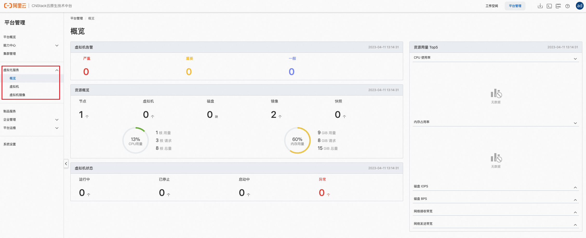
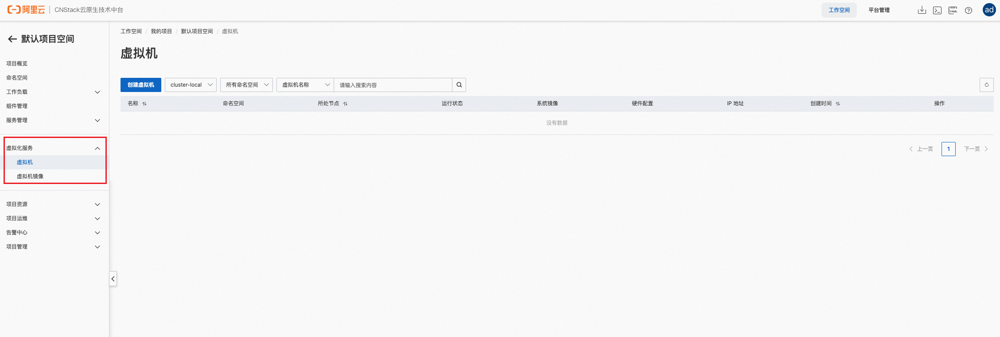

# CNStack 虚拟化社区版

## 简介

CNStack 虚拟化服务（CNStack Virtualization）是云原生的超融合解决方案，通过支持虚拟机+容器的混合部署架构，统一网络、存储与计算资源的分配管理，降低资源成本，提升运维效率。企业可将难以容器化的虚拟机应用无缝迁移到 CNStack 平台上，逐步实现 IT 系统的云原生化。

在 CNStack 2.0 中，虚拟化服务以“云服务”的形态进行部署，即能复用 CNStack 平台与多集群服务提供的多租资源管理、统一网关、集群管理、多集群资源分发等基础能力，又能不失灵活性地独立演进与发布。

CNStack 虚拟化社区版详细的功能说明，可访问 CNStack 控制台内嵌的使用文档：`https://$Master_IP_1:30383/doc-center/docs/t2320229`

## 产品优势

CNStack 虚拟化采用云原生基础架构，与传统的虚拟化软件相比具有以下优势：

* 轻量方便：单节点规格 8C 16G；高可用规格 8C 16G x 3；仅需数分钟即可在 CNStack 上一键增量部署。
* 成本更低：容器与虚拟机共池管理，灵活分配资源，减少碎片化造成的资源浪费，降低 TCO。
* 技术开放：采用云原生架构的虚拟化平台可按照 CSI、CNI 等规范自由对接各种类型的网络与存储资源，避免了厂商锁定的顾虑。
* 容器生态：虚拟机内的应用既可与 CNStack 其他云服务 & 云组件无缝协作，也可对接云原生社区丰富的组件。
* 兼容适配：只需宿主机硬件支持虚拟化即可，并支持 x86 & ARM 架构。宿主机支持 RHEL/CentOS 系列、麒麟、龙蜥信创操作系统；虚拟机支持 RHEL/CentOS 系列、Debian/Ubuntu 系列、龙蜥、Windows Server 操作系统。

## 产品部署

### 环境要求

* 集群中至少有一个节点支持硬件辅助虚拟化（常规物理服务器即可满足条件）

#### 检查节点是否支持虚拟化

* x86 架构：`(egrep -m1 -w '^flags[[:blank:]]*:' /proc/cpuinfo | egrep -wo '(vmx|svm)') && echo "支持虚拟化" || echo "不支持虚拟化"`
* ARM 架构：`(ls /dev/kvm) && echo "支持虚拟化" || echo "不支持虚拟化"`

### 在 CNStack 上增量部署 CNStack 虚拟化社区版

```bash
wget https://ack-a-utils.oss-cn-beijing.aliyuncs.com/cnstack-virt-ce/2.1-ce/cnstack-virt.clusterfile.yaml -O cnstack-virt.clusterfile.yaml && sealer apply -f cnstack-virt.clusterfile.yaml

# 等待所有组件变为Running状态
kubectl -n cnstack-virtualization get component
```

#### 使用软件模拟的虚拟化模式

如果集群内没有支持虚拟化的节点，我们也支持了软件模拟的虚拟化模式仅供测试使用。

**注意，软件模拟的虚拟化模式性能较差，虚拟机也会消耗更多的CPU与内存资源。**

```bash
wget https://ack-a-utils.oss-cn-beijing.aliyuncs.com/cnstack-virt-ce/2.1-ce/cnstack-virt.software-emulation.clusterfile.yaml -O cnstack-virt.software-emulation.clusterfile.yaml && sealer apply -f cnstack-virt.software-emulation.clusterfile.yaml

# 等待所有组件变为Running状态
kubectl -n cnstack-virtualization get component
```

部署完成后，通过浏览器访问 CNStack 社区版的控制台，在平台管理与项目空间视角，都可看到“虚拟化服务”的菜单栏。





### 使用对象存储保存虚拟机镜像

CNStack 虚拟化社区版默认提供了双架构的 Ubuntu Cloud Image 虚拟机镜像（默认用户名：`ali`，默认密码：`123`），如果你需要上传自己的虚拟机镜像，那么还需安装或对接对象存储服务。

#### 安装 CNStack 对象存储服务（vcns-oss）

* 集群中至少有一个节点的根目录有 50GiB 以上的可用空间

**TODO**


#### 使用外部对象存储服务（以阿里云 OSS 为例）

```bash
# 配置 OSS 访问方式
kubectl -n kubevirt edit cm ack-virt-api-cfg
## 配置说明如下
# oss:
#   endpoint: oss-cn-shanghai.aliyuncs.com
#   region: cn-shanghai
#   bucket: [Bucket 名称]
#   accessKeyID: [Access Key]
#   secretAccessKey: [Secret Key]

# 重启以应用配置
kubectl -n kubevirt rollout restart deploy ack-virt-api
```

## 纯离线环境的部署

如果部署环境没有互联网连接，请执行以下命令下载安装包

```bash
# 获取sealer工具
ARCH=amd64 # or arm64
wget http://sealerio.oss-cn-shanghai.aliyuncs.com/releases/sealer-v0.9.3-linux-${ARCH}.tar.gz -O sealer.tar.gz && tar -xvf sealer.tar.gz -C /usr/bin

# 在有互联网连接的主机，使用sealer pull拉取集群镜像和配置文件
sealer pull ack-agility-registry.cn-shanghai.cr.aliyuncs.com/ecp_builder/cnstack-virt-ce:v2-1-0-ce-2
wget https://ack-a-utils.oss-cn-beijing.aliyuncs.com/cnstack-virt-ce/2.1-ce/cnstack-virt.clusterfile.yaml -O cnstack-virt.clusterFile.yaml

# 保存集群镜像为tar文件
sealer save ack-agility-registry.cn-shanghai.cr.aliyuncs.com/ecp_builder/cnstack-virt-ce:v2-1-0-ce-2 -o cnstack-virt.tar

# 将sealer，集群镜像cnstack-virt.tar和配置文件cnstack-virt.clusterFile.yaml传输到没有互联网连接的部署主机，在部署主机执行以下命令
sealer load -i cnstack-virt.tar

sealer apply -f cnstack-virt.clusterFile.yaml
```

