# 创建第一个应用

在新部署集群中创建第一应用，要先执行开启集群、创建资源配额、创建命名空间、创建资源集的系列操作。这个例子帮助你快速完成一个Nginx应用的创建。

> 前置要求：创建CNStack社区版环境，并通过浏览器访问 `$IP:30088`，登录密码：admin/Ab123456；本例所运行的环境是阿里云ECS 8C16G规格

## 1. 开启集群

在“集群运维”处，基础设施-集群，找到设置，点击“开启集群”
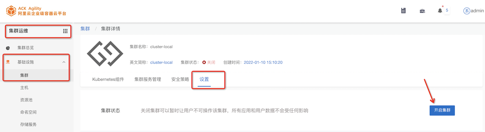

在仅包含基础能力版本中，可能有下面的提示，点击确定
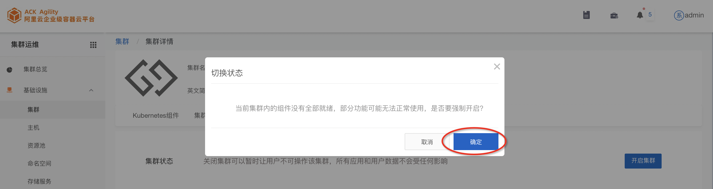

顺利开启的集群，如下：
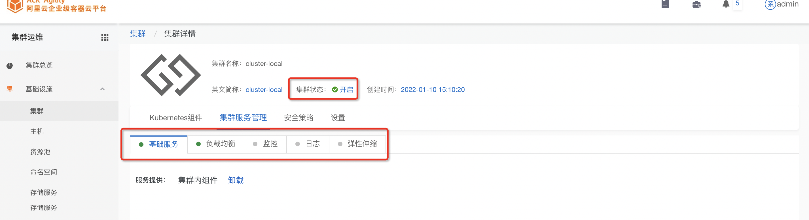

## 2 创建资源配额

进入平台管理，点击”默认组织“
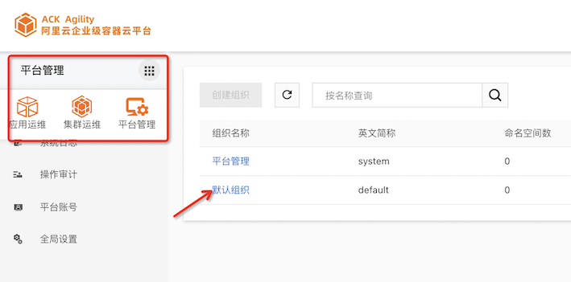

点击”添加配额“，选择“资源配额”
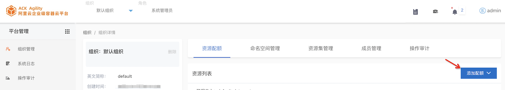
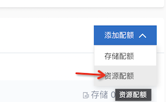

根据“可用配额”提示（与所在集群规格有关），选择分配的资源，为了本例能够运行，最好1C1G
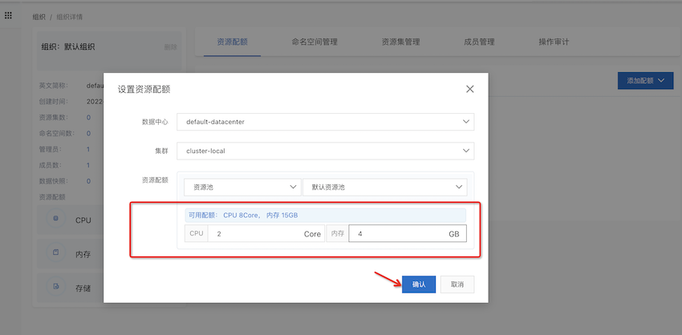

## 3 创建命名空间

进入“命名空间管理”，选择创建命名空间 - 普通命名空间
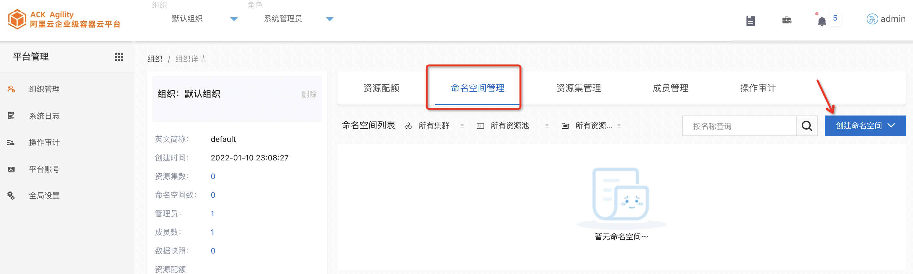
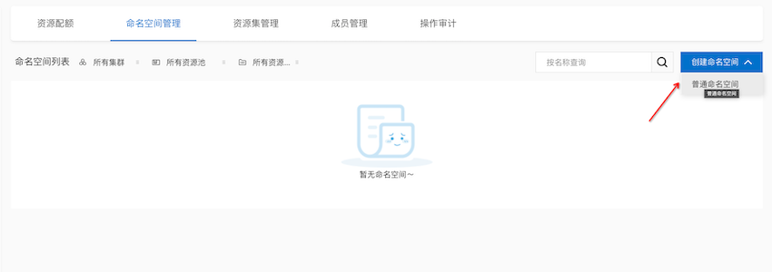

设置该命名空间的配额
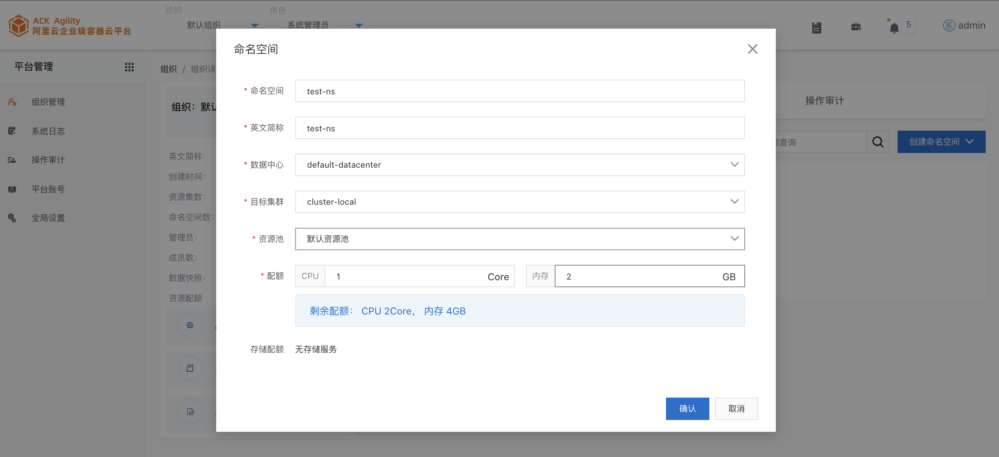

成功以后结果如下
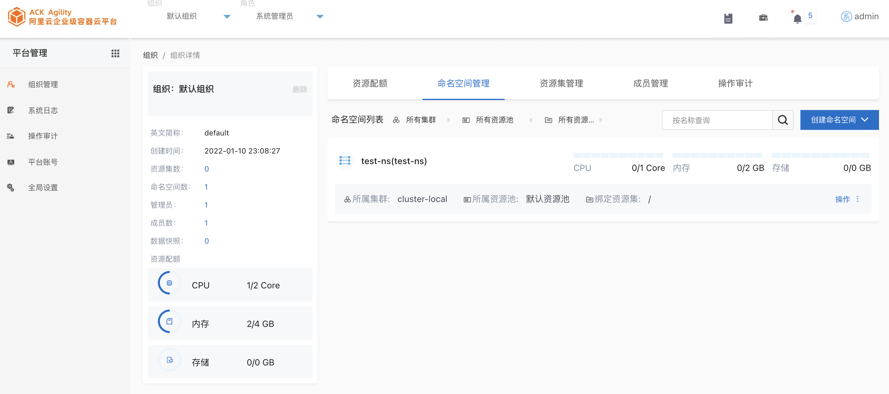

## 4 创建资源集

在“资源集管理”，点击创建资源集
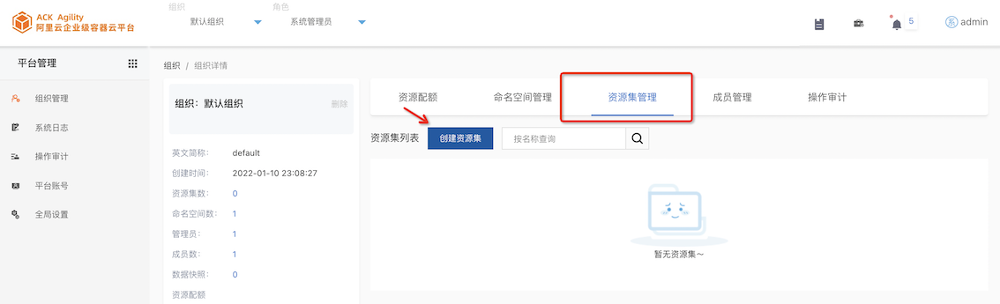

设置资源集名称，并和管理员，命名空间绑定
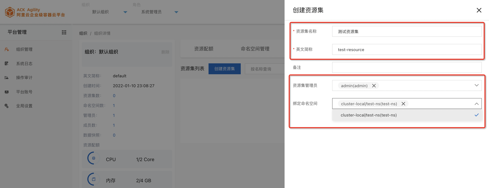

成功结果如下，现在可以创建应用了：）
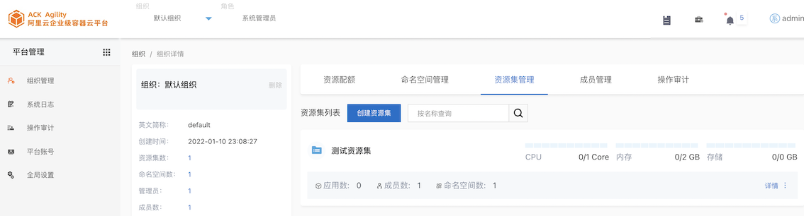

## 5 创建应用

转到“应用运维”，确保吊顶信息正确，点击“创建应用”
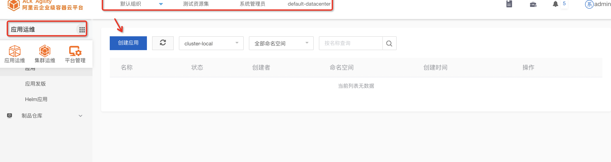

选择自定义
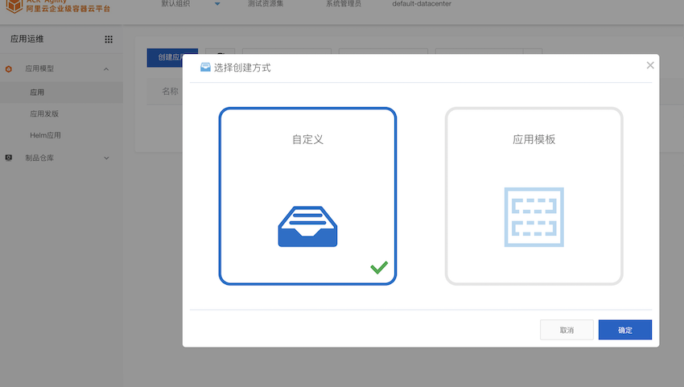

填写“应用名称”，然后下一步
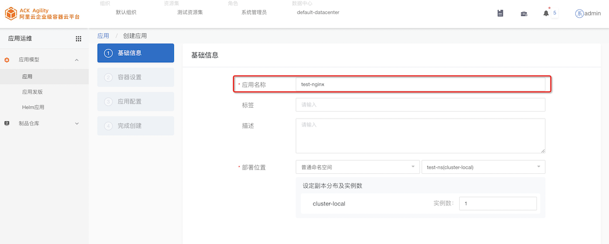

填写容器名称，选择镜像选择“自定义”
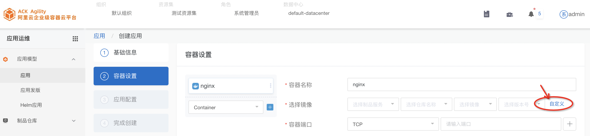

镜像地址可以在本机docker images查看，或者填写其它可以获取的版本。例如：

`ack-agility-registry.cn-shanghai.cr.aliyuncs.com/ecp_builder/nginx:1.17.10`

端口选择 30099 （确保这个端口在本机没有占用），性能选择“基本性能”
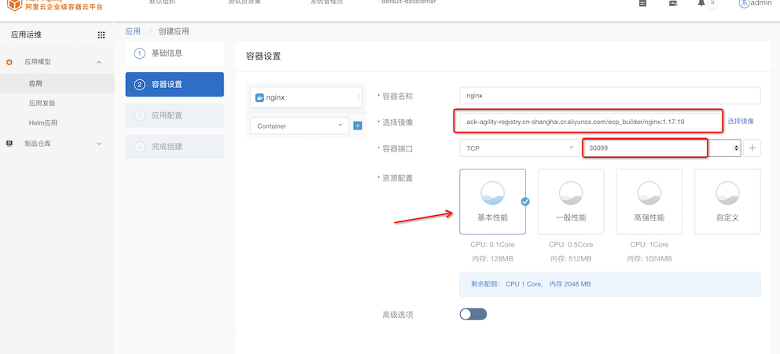

应用配置处，保持默认配置即可，点击完成，即创建成功
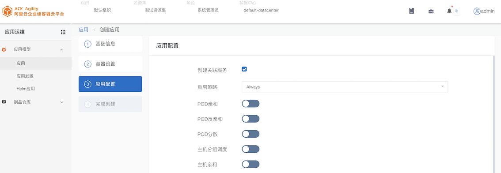
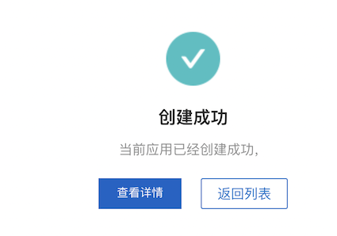

点击“返回列表”，即可看到应用情况

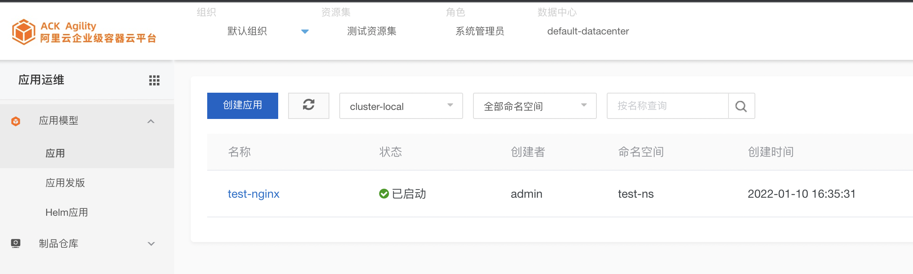

然后可以参考用户手册，进行更多操作。
